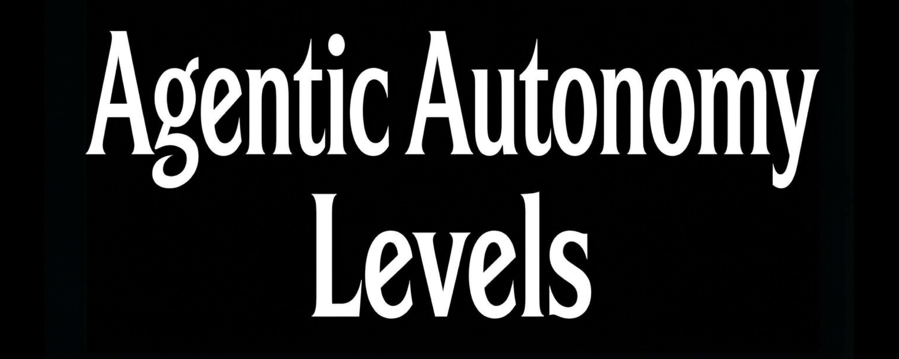
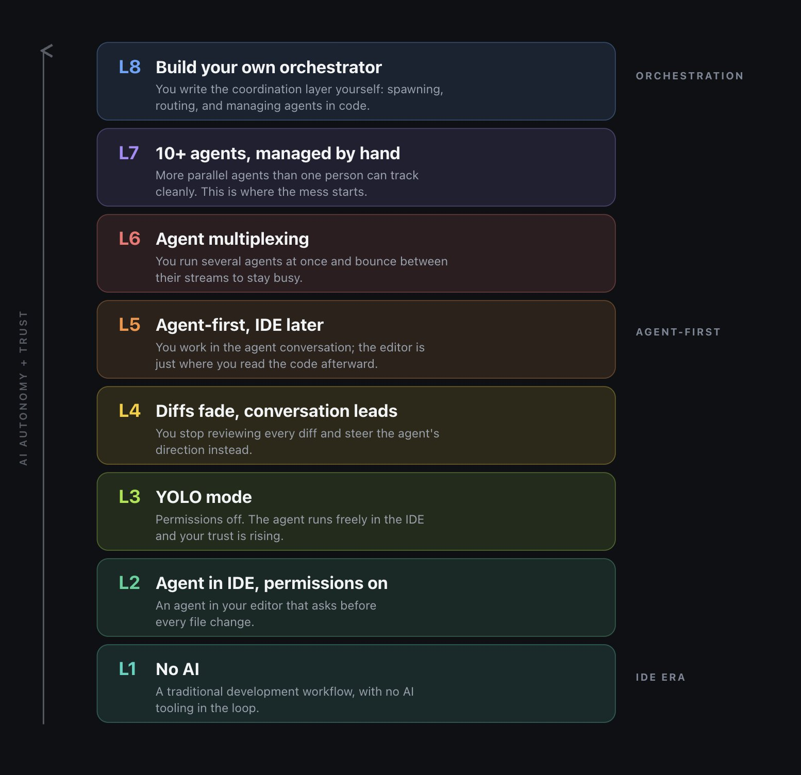
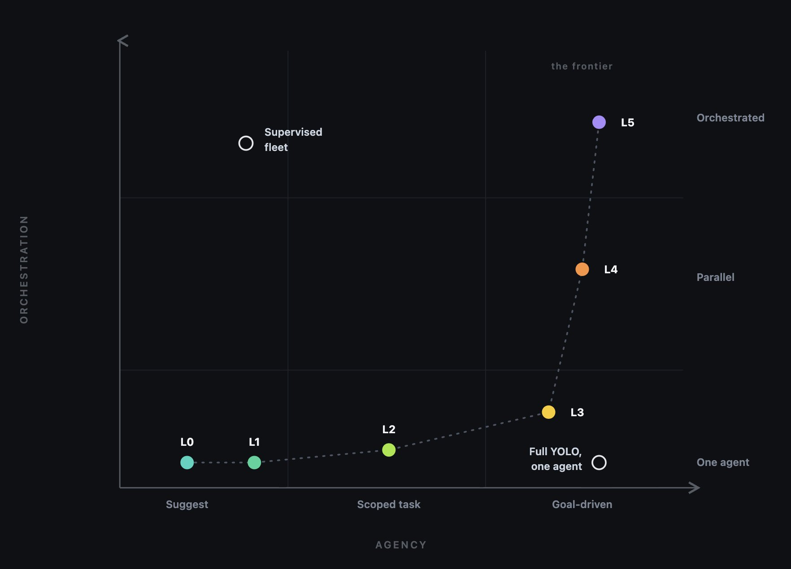
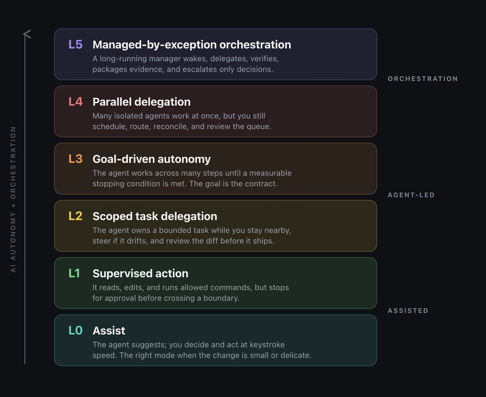
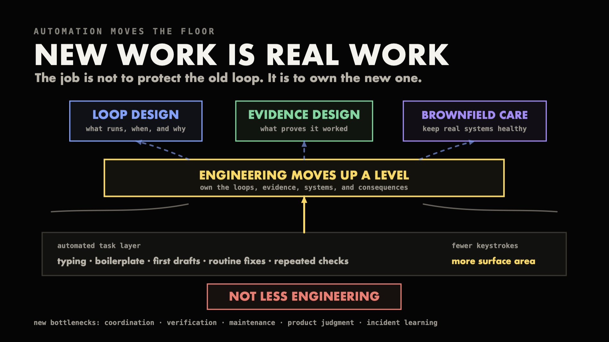

# @addyosmani 线程归档：addyosmani-2072885435312042327

- 原始 URL：https://x.com/addyosmani/status/2072885435312042327
- 抓取最终落地 URL：https://x.com/addyosmani/status/2072885435312042327
- 浏览器 Title：(19) Addy Osmani on X: "Agentic Autonomy Levels" / X
- 捕获子帖数：3

本文件由 `x-content-archiver` skill 抓取生成，按时间顺序排列。
图片为 `pbs.twimg.com` 原图（`name=orig`），存放在 `../assets/addyosmani-2072885435312042327`。

## 1. 2026-07-03T03:29:34.000Z

- 链接：https://x.com/addyosmani/status/2072885435312042327/analytics
- 关联 Article：https://x.com/addyosmani/article/2072885435312042327/media/2071855819176517632
- 关联 Article：https://x.com/addyosmani/article/2072885435312042327/media/2072870286291255297
- 关联 Article：https://x.com/addyosmani/article/2072885435312042327/media/2072883996971909120
- 关联 Article：https://x.com/addyosmani/article/2072885435312042327/media/2072871534998458368
- 关联 Article：https://x.com/addyosmani/article/2072885435312042327/media/2072884598644850688

**媒体归档：**

## 2. 2026-07-03T17:04:09.000Z

- 链接：https://x.com/addyosmani/status/2073090430196166976

Thanks! Glad to hear the levels resonated

## 3. 2026-07-03T20:24:26.000Z

- 链接：https://x.com/addyosmani/status/2073140834292453540

Glad if it was useful at all!
