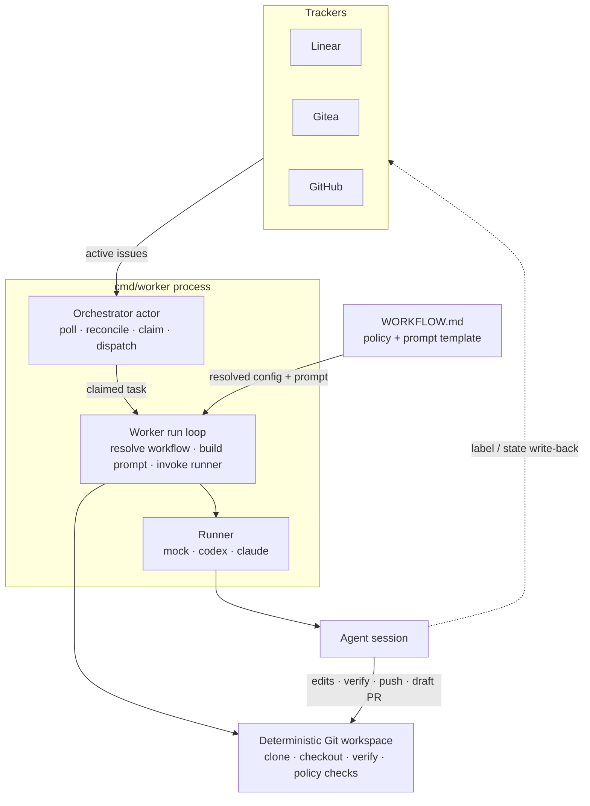
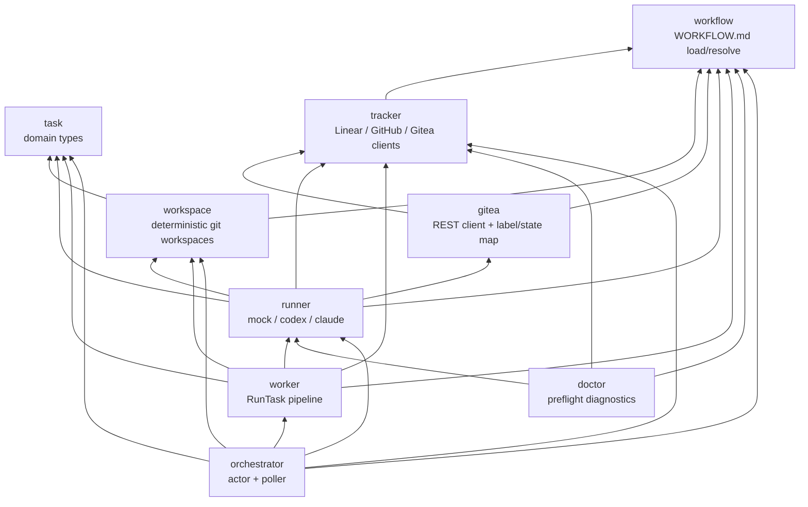
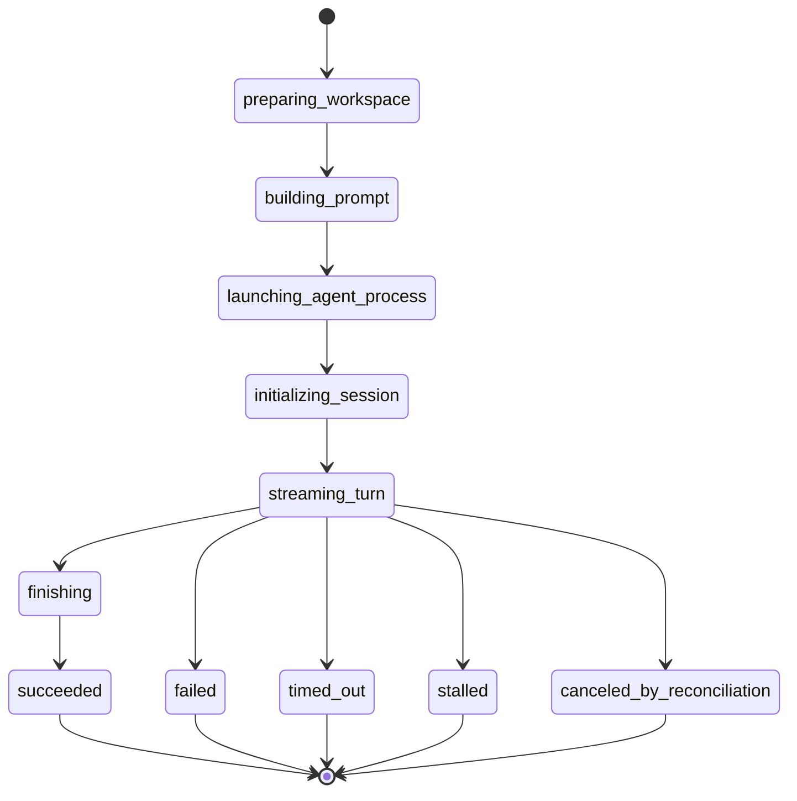
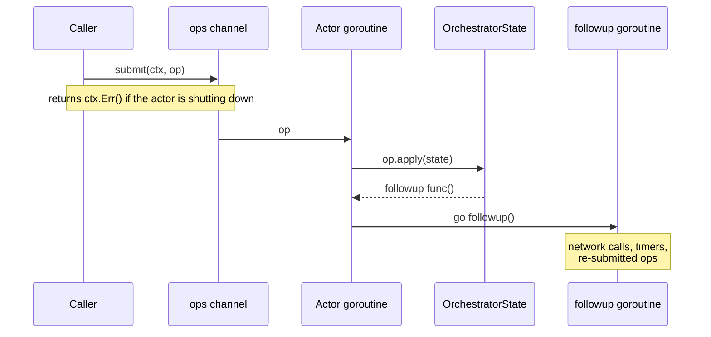

# Architecture

`aiops-platform` is a personal-productivity AI coding orchestrator: it watches a
tracker for issues that are ready for an agent, runs each one through a
deterministic, repo-owned workflow, and hands the result back as a draft pull
request for a human to review. It deliberately keeps the agent — not the
platform — responsible for the irreversible steps (source edits, verification,
push, PR creation, tracker state writes), so the platform stays a thin,
auditable conductor.

This document describes the **current** design. For the rationale behind the
Symphony-style approach see [ADR 0001](adr/0001-symphony-style-personal-orchestrator.md).

## System data flow

A single long-lived process (`cmd/worker`) runs the orchestrator actor. It polls
the tracker, reconciles in-memory state against what the tracker reports, claims
issues that are ready, and dispatches each as a run. There is no external job
queue — the claim/dispatch state lives in the actor and is rebuilt from tracker
polling on startup.

The dashed edges are **agent-owned**: per SPEC §1 the worker never pushes,
opens PRs, or writes tracker state itself. Verification is appended to the
prompt as a directive the agent runs before handing off, not executed as a
worker phase.

## Package layout

The `internal/` packages form an acyclic dependency graph. `task` and
`workflow` are dependency-free leaves; `orchestrator` sits at the top and wires
everything together behind small, consumer-defined interfaces.

## Run-attempt lifecycle

Each claimed task moves through the SPEC §7.2 run-attempt phases. The terminal
phases feed back into the orchestrator's retry/backoff/continuation scheduling.

The coarse task status reported externally is simpler: `queued → running →
{succeeded | failed}`.

## The orchestrator actor

All mutations of the orchestrator's in-memory state run on a single goroutine.
Callers never touch the state directly; they submit an operation onto a channel.
The op's `apply` runs on the actor goroutine and returns an optional `followup`
closure that runs on a fresh goroutine, so side effects (network calls, timers)
never block the actor loop. This serializes state access without a web of
mutexes.

A small number of late-bound dependencies (the candidate lister, the terminal
resolver) are swapped under a mutex rather than through the actor, which is why
the design is a hybrid rather than a pure actor.
