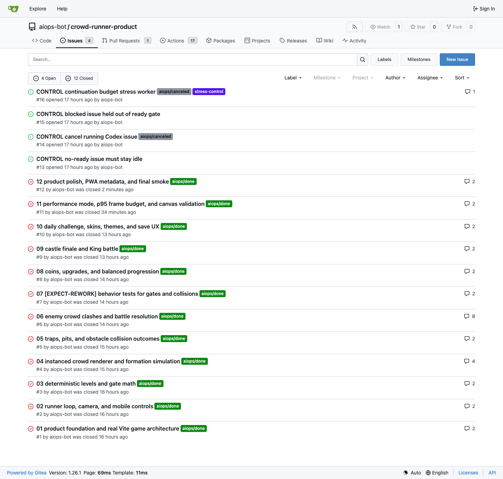
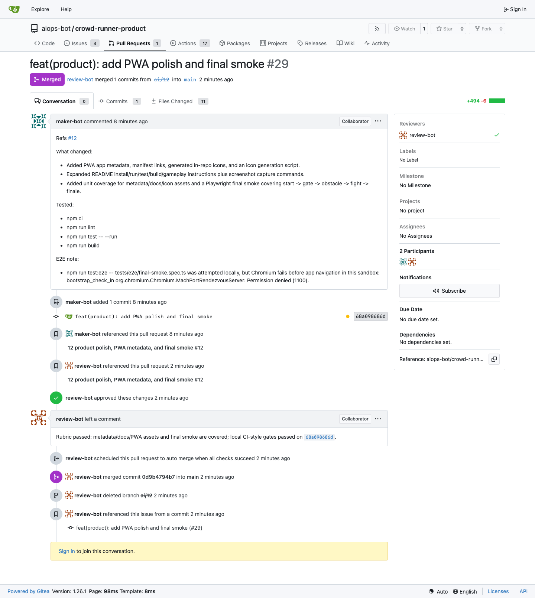
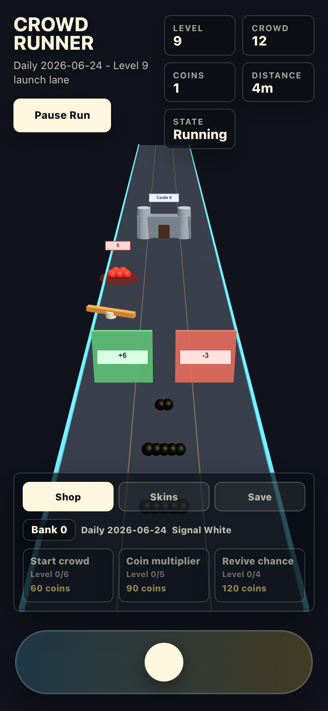
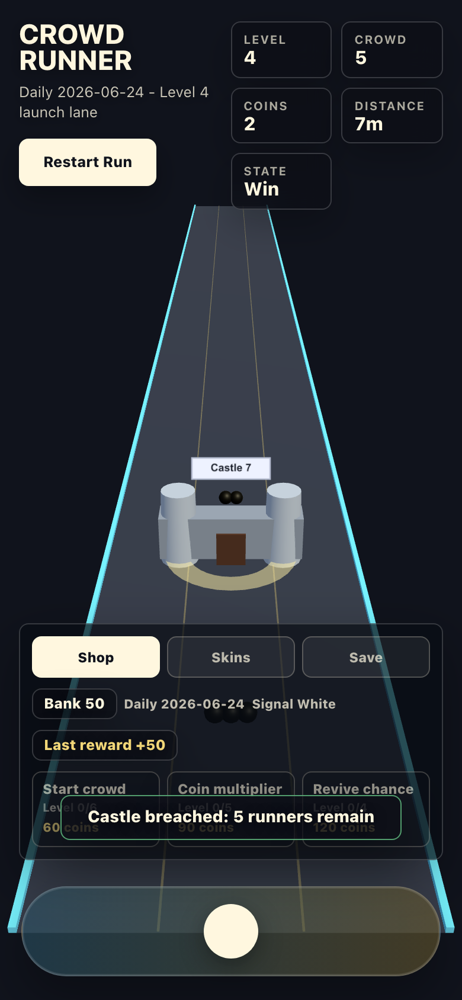

# Crowd Runner Real Codex E2E Report, v0.1.9

Date: 2026-06-25
Binary under test: `aiops-platform v0.1.9`
Topology: local Gitea, maker worker, reviewer worker, real `codex app-server`

This report is the curated, repository-safe summary of a live release-binary
exercise. The raw run directory, logs, Codex sessions, downloaded binaries, and
credentials stay out of git. This file records the reusable outcome, the
follow-up issue ledger, and selected screenshots for operator review and
promotion.

## Executive Verdict

| Area | Verdict | Notes |
|---|---|---|
| Release binary provenance | Pass | The release archive was verified with SHA256 and GitHub attestation before running. |
| aiops-platform lifecycle | Pass | Real maker/reviewer Codex workers moved product issues through `Todo -> Human Review -> Done`. |
| Real Codex product delivery | Pass | Codex built a substantial Vite + React + TypeScript + Three.js crowd-runner product from tracker issues. |
| Abnormal/control scenarios | Pass with one harness gap | No-label idle, reconcile cancellation, and Rework were captured. The low-turn continuation control did not deterministically exhaust. |
| Product release quality | Partial | Fresh-clone lint, unit tests, and build passed. Product E2E/performance still need follow-up before treating the game as publishable. |

The run is a successful aiops-platform lifecycle proof point and a useful
promotion story. It should not be described as a finished commercial game.

## What Was Built

The exercise did not reuse the earlier private `crowdrunner` implementation. A
new local Gitea repository, `crowd-runner-product`, was created and populated by
real Codex agents issue by issue.

The final product includes:

- portrait-first 3D runner gameplay;
- gate selection and crowd multiplication;
- instanced crowd rendering and formation simulation;
- traps, pits, obstacle collision outcomes;
- enemy crowd clashes;
- coins, upgrades, skins, themes, and save UX;
- deterministic daily challenges;
- castle finale and King battle;
- performance diagnostics and PWA/release polish.

## Screenshots

Final Gitea issue state:

PR #29 merged by the reviewer workflow:

Mobile gameplay with gate, obstacle, and enemy-combat evidence:

Castle finale win state:

## Issue And PR Results

| Product issue | Slice | PR | Result |
|---|---|---|---|
| #1 | Vite game architecture foundation | #17 | Merged, done |
| #2 | Runner loop, camera, mobile controls | #18 | Merged, done |
| #3 | Deterministic levels and gate math | #19 | Merged, done |
| #4 | Instanced crowd renderer and formation | #20 | Rework once, merged, done |
| #5 | Traps, pits, obstacle collisions | #21 | Merged, done |
| #6 | Enemy crowd clashes and battle resolution | #23 | Rework three times, merged, done |
| #7 | Behavior coverage for gate, obstacle, combat | #24 | Merged, done |
| #8 | Coins, upgrades, progression | #25 | Merged, done |
| #9 | Castle finale and King battle | #26 | Merged, done |
| #10 | Daily challenge, skins, themes, save UX | #27 | Merged, done |
| #11 | Performance diagnostics / adaptive quality | #28 | Resumed without manual intervention, merged, done |
| #12 | PWA polish and final smoke | #29 | Resumed without manual intervention, merged, done |

The first report was frozen manually at the #10 milestone. A later
no-intervention resume proved #11/#12 were schedulable: maker completed #11,
reviewer merged PR #28, maker then unlocked #12, and reviewer merged PR #29.

## Control Scenarios

| Scenario | Result |
|---|---|
| No-ready / no-state-label issue | Passed. Issues without an `aiops/*` state label stayed idle. |
| Running cancellation | Passed. A live Codex run was stopped by reconciliation after the issue was labeled canceled. |
| Rework loop | Passed. Reviewer rejected product PRs and maker converged through Rework. |
| Low-turn continuation control | Partial. The stress agent completed inside one turn, so the control did not prove exhaustion. |

## Product Verification

Fresh-clone verification after the main run showed:

| Gate | Result |
|---|---|
| `npm ci` | Passed, with one low-severity audit warning and install-script approval warnings. |
| `npm run lint` | Passed. |
| `npm run test -- --run` | Passed. |
| `npm run test:e2e` | Failed in 2 of 6 tests in the pre-#28/#29 evidence pass. |
| `npm run build` | Passed. |

Main product follow-ups:

- Playwright `getByText("Level")` locator became ambiguous after more UI labels
  were added.
- WebGL runner-theme pixel validation returned zero despite other instanced
  rendering diagnostics passing.
- The pre-#28 mobile performance sample had p95 around `50.3ms`; this should be
  rechecked after the performance diagnostics PR.

## Follow-Up Issues Filed

### aiops-platform

| Issue | Scope |
|---|---|
| [#986](https://github.com/xrf9268-hue/aiops-platform/issues/986) | Harden Codex app-server `thread/start` startup timeout handling. |
| [#987](https://github.com/xrf9268-hue/aiops-platform/issues/987) | Align vendored Codex app-server schema with `codex-cli 0.142.0`. |
| [#988](https://github.com/xrf9268-hue/aiops-platform/issues/988) | Classify successful runner exits that leave the issue active. |
| [#989](https://github.com/xrf9268-hue/aiops-platform/issues/989) | Make continuation-budget control deterministic. |
| [#990](https://github.com/xrf9268-hue/aiops-platform/issues/990) | Add stop-after-N milestone freeze for lifecycle runs. |
| [#991](https://github.com/xrf9268-hue/aiops-platform/issues/991) | Distinguish operator interruption from scheduler failure in reports. |
| [#992](https://github.com/xrf9268-hue/aiops-platform/issues/992) | Pass dashboard URLs to doctor during binary lifecycle preflight. |

### crowd-runner-product

These were filed in the local Gitea product repository without `aiops/*` labels
so they do not auto-dispatch until a human triages them.

| Issue | Scope |
|---|---|
| #30 | Use stable locators for HUD level and state assertions. |
| #31 | Make runner-theme WebGL validation reliable. |
| #32 | Address npm audit and install-script warnings. |

Deferred product checks:

- Re-run performance evidence after PR #28 before filing a new performance bug.
- Re-run final Playwright smoke in a clean browser environment after PR #29
  before filing a PWA/final-smoke product bug.

## Promotion Copy Draft

This experiment used the aiops-platform v0.1.9 GitHub release binary, local
Gitea, and two real Codex workers to build a fresh 3D crowd-runner game. The
maker worker implemented features from Gitea issues and opened PRs; the reviewer
worker independently reviewed, rejected weak changes through Rework, approved
passing PRs, and advanced issues to Done.

The result was not a toy single-screen demo: Codex assembled a Vite + React +
TypeScript + Three.js/WebGL game with gates, crowd growth, obstacles, enemy
clashes, progression, skins, saves, daily challenges, castle finale, performance
diagnostics, and PWA polish. The platform lifecycle passed end to end, while the
product still has ordinary follow-up work before publication.

The most important lesson is the boundary: aiops-platform schedules, runs, and
observes; the agents own product changes, PRs, review feedback, and tracker
handoff.

## Repository Artifacts

Reusable artifacts committed with this report:

- `scripts/e2e-crowdrunner-bootstrap.sh`
- `scripts/e2e-crowdrunner-capture.py`
- `scripts/e2e-crowdrunner-report.py`
- `scripts/crowdrunner_lifecycle_e2e_test.go`
- `docs/runbooks/local-gitea-crowdrunner-lifecycle-e2e.md`

Do not commit raw run roots, `env.local`, Codex auth files, downloaded release
archives, cache directories, workspace clones, or full Codex session JSONL.
