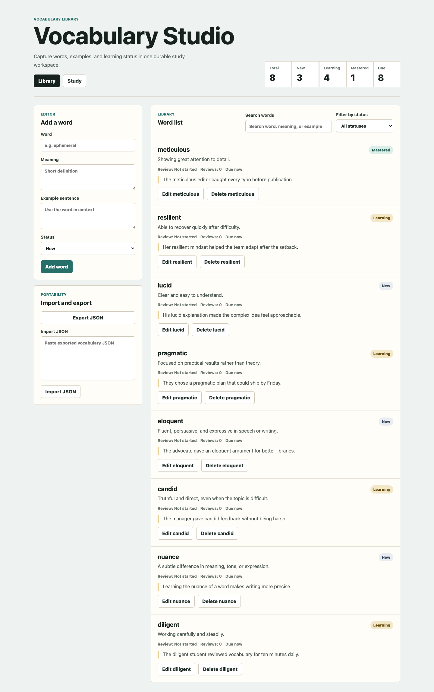
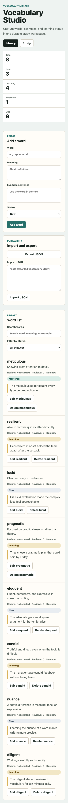

# GitHub maker/reviewer auto-merge vocabulary app E2E report

## Verdict

**PASS for the requested run.** On 2026-06-29, the latest formal
`aiops-platform` release binary (`v0.1.11`, `darwin_arm64`) ran a real GitHub
maker/reviewer auto-merge exercise against a disposable repository. The maker
agent autonomously built a web vocabulary-learning app through three
incremental issues. The reviewer agent independently reviewed each PR, approved
the reviewed head, enabled GitHub auto-merge, confirmed merge completion, and
then marked each issue `aiops:done` / closed.

No operator code edits, PR edits, or label fixes were made after activation.
Operator activity was limited to setup, sequential issue activation, necessary
screenshots, JSON/log capture, final fresh-clone verification, and report
generation.

The reusable run-root `report.md` remains conservatively marked
`INCOMPLETE` because that helper still expects a forced Rework path. This run
intentionally did not manufacture a Rework after the operator requested only
necessary screenshots and records, with no mid-run intervention.

## Links and roots

- Release: <https://github.com/xrf9268-hue/aiops-platform/releases/tag/v0.1.11>
- Disposable repo: <https://github.com/xrf9268-hue/aiops-e2e-vocab-20260629-174719>
- Issues: <https://github.com/xrf9268-hue/aiops-e2e-vocab-20260629-174719/issues>
- PRs: <https://github.com/xrf9268-hue/aiops-e2e-vocab-20260629-174719/pulls>
- Actions: <https://github.com/xrf9268-hue/aiops-e2e-vocab-20260629-174719/actions>
- Run root: `/tmp/aiops-github-vocab-maker-reviewer-20260629-174719`

## In-repo archive

- Report:
  `docs/reports/github-vocab-maker-reviewer-automerge-e2e-v0.1.11.md`
- Final desktop screenshot:
  `docs/reports/assets/github-vocab-maker-reviewer-automerge-e2e-v0.1.11/final-app-desktop.png`
- Final mobile screenshot:
  `docs/reports/assets/github-vocab-maker-reviewer-automerge-e2e-v0.1.11/final-app-mobile.png`

This committed archive is intentionally selective. It does not include
`env.local`, `secrets/`, GitHub auth homes, downloaded binaries, raw cache
directories, or full worker output.

## Binary, identity, and preflight

| Item | Result |
| --- | --- |
| Latest release | `v0.1.11`, published `2026-06-29T08:25:22Z` |
| Release asset | `aiops-platform_v0.1.11_darwin_arm64.tar.gz` |
| Asset checksum | `sha256:b7cd2d8a941480086d9f220189fa81c392a3782bcf5652660a0b13ffadf4362a` |
| `shasum -a 256 -c` | PASS |
| GitHub attestation verify | PASS |
| SBOM | CycloneDX `1.6`, serial `urn:uuid:dc99df9d-eb07-49c1-8ebb-5470f728294c` |
| `worker --version` | `v0.1.11` |
| `tui --version` | `v0.1.11` |
| Codex runtime | `codex-cli 0.140.0`; doctor passed with schema-version warning |
| Setup identity | `xrf9268-hue` |
| Maker identity | `xrf-9527` |
| Reviewer identity | `zjlgdx` |
| Maker/reviewer doctor | PASS for both workflows in `--deploy=binary --mode=real` |

Preflight evidence remains in the run root under `artifacts/`,
`logs/maker-doctor.log`, and `logs/reviewer-doctor.log`.

## Workflow shape

- Worker pair:
  - Maker dashboard: `http://127.0.0.1:4501`
  - Reviewer dashboard: `http://127.0.0.1:4502`
- Workflows:
  - `examples/github-maker-WORKFLOW.md`
  - `examples/github-reviewer-automerge-WORKFLOW.md`
- Maker active states: `aiops:todo`, `aiops:rework`
- Reviewer active state: `aiops:human-review`
- Terminal state: closed issue plus `aiops:done`
- CI/branch protection:
  - Required check: `build-test`
  - Required approvals: 1
  - Squash merge enabled
  - GitHub auto-merge enabled
- Agent runner: real `codex app-server`, not mock
- Sandbox: `danger-full-access`

## Timeline

Times are UTC.

| Time | Event |
| --- | --- |
| 2026-06-29T08:25:22Z | Latest release `v0.1.11` identified |
| 2026-06-29T09:47 | Run root created |
| 2026-06-29T09:55-09:56 | Seed Vite React TypeScript repo pushed; initial `build-test` passed |
| 2026-06-29T09:58 | Branch protection, auto-merge, and labels configured |
| 2026-06-29T09:59 | Three GitHub issues created without active labels |
| 2026-06-29T10:00 | Release preflight and maker/reviewer doctors passed |
| 2026-06-29T10:03 | Issue #1 activated |
| 2026-06-29T10:17:02Z | PR #4 merged |
| 2026-06-29T10:17:32Z | Issue #1 closed with `aiops:done` |
| 2026-06-29T10:19 | Issue #2 activated after #1 done/closed |
| 2026-06-29T10:34:41Z | PR #5 merged |
| 2026-06-29T10:35:24Z | Issue #2 closed with `aiops:done` |
| 2026-06-29T10:37 | Issue #3 activated after #2 done/closed |
| 2026-06-29T10:50:55Z | PR #6 merged |
| 2026-06-29T10:51:34Z | Issue #3 closed with `aiops:done` |
| 2026-06-29T10:54 | Final capture, fresh clone verification, and screenshots completed |

## Issue and PR results

| Issue | Scope | Result | PR | Author | Reviewer | Merged at |
| --- | --- | --- | --- | --- | --- | --- |
| #1 | Vocabulary library foundation | CLOSED + `aiops:done` | #4 | `xrf-9527` | `zjlgdx` APPROVED | 2026-06-29T10:17:02Z |
| #2 | Study mode and review progress | CLOSED + `aiops:done` | #5 | `xrf-9527` | `zjlgdx` APPROVED | 2026-06-29T10:34:41Z |
| #3 | Import/export and study summary polish | CLOSED + `aiops:done` | #6 | `xrf-9527` | `zjlgdx` APPROVED | 2026-06-29T10:50:55Z |

Each merged PR had a successful `build-test` check and a reviewer approval on
the merged head:

- PR #4 head `3300a059c2da6e8e5865457f1cc1e990dc9d88e0`
- PR #5 head `a846875f769a779a787124a7f18177468d3d76de`
- PR #6 head `da26cb4bec038c2350b72e0e8fdeced3ce2bcfc1`

## Governance checks

| Check | Result |
| --- | --- |
| Latest formal release binary used | PASS |
| Worker stayed scheduler/runner/tracker reader | PASS |
| Maker opened PRs but did not approve, merge, Done, or close | PASS |
| Reviewer approved, enabled auto-merge, confirmed merge, then Done/closed | PASS |
| Distinct maker/reviewer identities | PASS |
| `build-test` required by branch protection | PASS |
| One approval required by branch protection | PASS |
| Issue #3 activated only after #2 was done/closed | PASS |
| Rework path | N/A by operator request; no failure was manufactured |

## Final fresh-clone verification

Fresh clone path:
`/tmp/aiops-github-vocab-maker-reviewer-20260629-174719/final-verify/app`

| Command | Result |
| --- | --- |
| `npm ci` | PASS; 166 packages installed, 0 vulnerabilities |
| `npm test` | PASS; 10 Vitest tests |
| `npm run build` | PASS; Vite build succeeded |
| `npm run test:e2e` | PASS; 2 Playwright tests |

Verification logs remain under:
`/tmp/aiops-github-vocab-maker-reviewer-20260629-174719/final-verify/logs/`.

## Screenshots

Desktop:

Mobile:

Screenshot SHA256:

| File | SHA256 |
| --- | --- |
| `final-app-desktop.png` | `33291a9db7ed7746d1123a0ad599d57e948f5086eee7a4d168cb35e39d60c8fa` |
| `final-app-mobile.png` | `61622fe849af6cb93a8830d85d4dbe6d20520bd14df3549cf564461525203304` |

## Evidence index

The full local evidence bundle remains at:
`/tmp/aiops-github-vocab-maker-reviewer-20260629-174719`.

Important paths:

- `artifacts/release-view-summary.json`
- `artifacts/sha256.log`
- `artifacts/attestation.log`
- `artifacts/sbom-summary.json`
- `logs/maker-doctor.log`
- `logs/reviewer-doctor.log`
- `logs/maker-worker.log`
- `logs/reviewer-worker.log`
- `forge-json/operator-final-issues.json`
- `forge-json/operator-final-prs.json`
- `final-verify/logs/*.log`
- `reports/operator-verdict.md`
- `reports/report.md`
- `reports/merge-mechanism-retro.md`

## Notes and residual risks

- The reusable report helper still expects a Rework path and therefore marks
  the generated `reports/report.md` as `INCOMPLETE`. For this run, Rework is
  intentionally N/A because the operator requested only necessary screenshots
  and records, with no mid-run intervention or manufactured failure.
- `worker --doctor` warned that host `codex-cli 0.140.0` differs from the
  pinned schema version `0.142.0`; app-server probe and both real doctors still
  passed.
- Several GitHub CLI/API calls hit transient EOF or TLS handshake timeouts
  during capture/polling. Retried reads succeeded and did not change the final
  outcome.
- Raw worker app-server streams are large and truncated in worker summary
  payloads after 1 MiB. The durable evidence for this report is the GitHub JSON,
  worker logs, release artifacts, and final fresh-clone verification logs.
