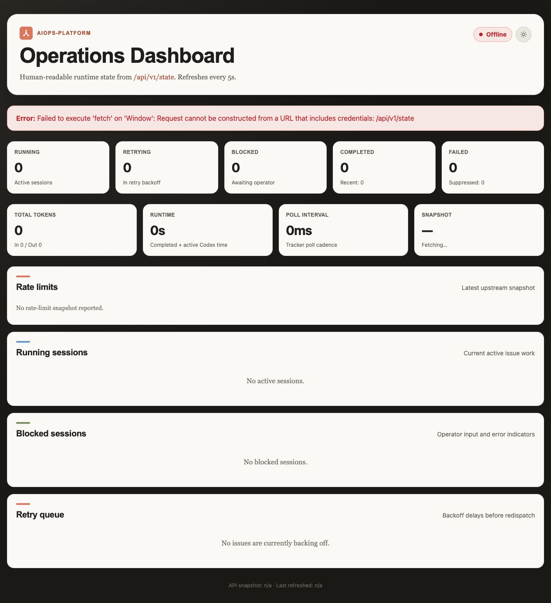

# Docker + Linear E2E Validation Report

Date: 2026-05-26
Repo: `xrf9268-hue/aiops-platform`
Base validated commit: `7f4d69e` (`origin/main`)
Linear workspace: `aishuo-de`
Linear project: `aiops-e2e-test` (`project_slug: 01d2b95da4b2`)

The temporary Linear API key was used only from local shell/container
environment during validation. It is intentionally omitted from this report.

## Scope

Validate the latest code in a real local Docker install against live Linear,
using a todo-list style lifecycle consistent with the upstream Symphony model:

- poll live `Todo` Linear issues,
- prepare deterministic isolated workspaces,
- run both the repo-supported `mock` agent and real `codex app-server`,
- allow the real agent to write Linear through the advertised `linear_graphql`
  tool surface,
- verify run-summary artifacts,
- confirm terminal-state reconciliation and workspace cleanup,
- record every observed problem as an issue or documented validation note.

Upstream reference points used for calibration:

- `openai/symphony` README and SPEC: Symphony is the scheduler/runner and
  tracker reader; ticket writes are normally performed by the agent/tool
  surface.
- `openai/symphony` Elixir reference: live E2E creates disposable Linear
  resources, runs an agent turn, verifies a workspace side effect, and closes
  the issue.

## Local Gates

Passed on the pulled latest code:

```bash
gofmt -l $(git ls-files '*.go')
go mod tidy && git diff --exit-code -- go.mod go.sum
go test -race -covermode=atomic ./...
go build ./cmd/worker ./cmd/tui
docker build --pull --tag aiops-platform:local .
go test -tags e2e -race -timeout 15m ./test/e2e/...
```

The documented command below failed because the referenced command directories
no longer exist:

```bash
go build ./cmd/worker ./cmd/linear-poller ./cmd/gitea-poller
```

Observed:

```text
stat /Users/yvan/developer/aiops-platform/cmd/linear-poller: directory not found
stat /Users/yvan/developer/aiops-platform/cmd/gitea-poller: directory not found
```

Tracked as GitHub issue #434.

## Mock-Agent Docker Lifecycle

The first pass validated the worker/tracker/workspace/verify loop with the
repo-supported `mock` agent:

```bash
docker compose -p aiopslinear \
  -f deploy/docker-compose.yml \
  -f deploy/docker-compose.dashboard.yml \
  -f /tmp/aiops-docker-linear-e2e/docker-compose.workflow.yml \
  up -d --no-build worker
```

Temporary workflow:

- `tracker.kind: linear`
- `tracker.project_slug: 01d2b95da4b2`
- `tracker.active_states: [Todo, In Progress]`
- `tracker.terminal_states: [Done, Canceled]`
- `agent.default: mock`
- `agent.max_turns: 100`
- `verify.commands: [test -s .aiops/RUN_SUMMARY.md]`

Final clean lifecycle issue:

- Linear: `AIS-15`
- Title: `Todo list lifecycle E2E terminal cleanup 04:40:12Z`
- Initial state: `Todo`
- Terminal state set by harness after successful verify: `Canceled`

Key worker evidence:

```text
startup reconciliation finished ... active_issues:1 ... terminal_issues:5
event=workflow_resolved ... issue_identifier=AIS-15 source=file path=/app/examples/WORKFLOW.md
Preparing worktree (new branch 'ai/c5e8b415-0b98-46d7-8392-eb8896a97f99')
event=runner_end ... model:mock ok:true summary:mock completed
event=verify_end ... command:test -s .aiops/RUN_SUMMARY.md ... exit_code:0 ... status:ok
event=reconcile_workspace ... action:remove identifier:AIS-15 ... reason:terminal state:Canceled
```

Final state API:

```json
{
  "counts": {
    "running": 0,
    "blocked": 0,
    "retrying": 0,
    "completed": 1,
    "failed": 0,
    "completed_total": 2,
    "failed_total": 0
  }
}
```

## Real Codex App-Server Setup

The host Codex binary at `/opt/homebrew/bin/codex` is a macOS Mach-O binary, so
it cannot be mounted directly into the Debian worker container.

The requested online install command was tested inside the Linux ARM64 worker
image:

```bash
curl -fsSL https://chatgpt.com/codex/install.sh | sh
```

It failed:

```text
==> Installing Codex CLI
==> Detected platform: Linux (ARM64)
==> Resolved version: 0.133.0
==> Downloading Codex CLI
Could not find SHA-256 digest for codex-package-aarch64-unknown-linux-musl.tar.gz in codex-package_SHA256SUMS.
```

Tracked as GitHub issue #437.

Validation continued with a manual release-package install in the worker image:

- image tag: `aiops-platform:codex-app-server-e2e`
- Codex package: `codex-package-aarch64-unknown-linux-musl.tar.gz`
- verified SHA-256:
  `7a77d416f9ce16f18e09fdc57622a15aab6ad131c34e078ab9d55a13bb3d9b05`
- installed version: `codex-cli 0.133.0`

The container used a temporary mounted Codex home copied from the host
ChatGPT-authenticated Codex session. `codex login status` succeeded inside the
container, and `codex app-server` started successfully.

## Real Codex App-Server Lifecycle

Fixture repository:

- work repo: `/tmp/aiops-codex-todo-repo`
- bare origin: `/tmp/aiops-codex-todo-origin.git`
- initial commit: `551ef6b`
- initial file: `todos.txt` with `- [ ] seed task`

The production-semantics workflow allowed the agent to perform Linear writes
through the advertised dynamic tool surface:

- `agent.default: codex`
- `codex.command: codex`
- `codex.args: [app-server]`
- `codex.linear_graphql.allow_mutations: true`
- `codex.linear_graphql.allowed_mutations: [issueUpdate, commentCreate]`
- `thread_sandbox: danger-full-access`
- `verify.commands: [test -s .aiops/RUN_SUMMARY.md]`

`thread_sandbox: danger-full-access` was required inside this Docker validation
container because Codex command execution with `workspace-write` failed under
the container sandbox with:

```text
bwrap: No permissions to create a new namespace
```

The validation container was already isolated by Docker. This should be
documented before promoting a production deployment recipe.

### First Real Run Finding

The first production-semantics run exposed a real tool-surface bug: the
`linear_graphql` runner sent the Linear API key as a Bearer token. Linear
rejected it:

```text
It looks like you're trying to use an API key as a Bearer token. Remove the
Bearer prefix from the Authorization header.
```

Tracked as GitHub issue #436.

A local patch was applied for validation:

- `internal/runner/tools.go`: send raw Linear API keys unless the configured
  value has surrounding whitespace.
- `internal/runner/tools_test.go`: assert raw Linear token forwarding.
- `internal/runner/codex_app_server_test.go`: assert app-server tool calls
  receive raw Linear token authorization.

Verification after the patch:

```bash
gofmt -l $(git ls-files '*.go')
go test ./internal/runner
docker build --tag aiopslinear-worker .
docker build --tag aiops-platform:codex-app-server-e2e /tmp/aiops-codex-image-manual
```

### Two Completed Real Tasks

After rebuilding with the local #436 patch, two live Linear issues completed
through the real `codex app-server` loop. The agent edited the todo fixture,
wrote `.aiops/RUN_SUMMARY.md`, posted a Linear comment, and moved the issue to
`Done` using `linear_graphql`.

Task 1:

- Linear: `AIS-18`
- Title: `Codex server real handoff todo task 1 05:55:41Z`
- Requested todo: `schedule planning review`
- Final state: `Done`
- Linear comment created at: `2026-05-26T06:03:05.137Z`
- Comment summary: added `- [ ] schedule planning review`, verified
  `todos.txt`, wrote `.aiops/RUN_SUMMARY.md`, no PR/push for the fixture.

Task 2:

- Linear: `AIS-19`
- Title: `Codex server real handoff todo task 2 05:55:41Z`
- Requested todo: `update onboarding checklist`
- Final state: `Done`
- Linear comment created at: `2026-05-26T06:04:27.737Z`
- Comment summary: added `- [ ] update onboarding checklist`, confirmed it was
  present exactly once, reviewed `git diff -- todos.txt .aiops/RUN_SUMMARY.md`,
  no PR/push for the fixture.

Key worker evidence:

```text
tool_call_mutation ... operation_field:commentCreate ... tool:linear_graphql
tool_call_mutation ... operation_field:issueUpdate ... tool:linear_graphql
issueUpdate ... success:true ... state Done
event=verify_end ... status:ok
event=reconcile_workspace ... action:remove identifier:AIS-19 ... reason:terminal state:Done
```

The compose stack was stopped after validation:

```bash
docker compose -p aiopscodex \
  -f deploy/docker-compose.yml \
  -f /tmp/aiops-codex-server-e2e/docker-compose.workflow.yml \
  down
```

## Screenshot

Dashboard screenshot:



The screenshot also captures a dashboard/browser-auth issue: opening the
dashboard with a credentialed Basic-auth URL loaded the page but left the
client-side state fetch offline. Authenticated curl to the same state API
worked. Tracked as GitHub issue #435.

## Issues Filed

- #434: Docs: CI build command still references removed poller commands.
- #435: Dashboard: credentialed Basic-auth URL leaves state fetch offline.
- #436: `linear_graphql` sends Linear API keys with an invalid Bearer prefix.
- #437: Validation: Codex online installer fails for Linux ARM64 worker image.

## Additional Notes

- The worker image did not include `rg`. Codex tried `rg --files`, received
  `/bin/bash: line 1: rg: command not found`, and recovered with other shell
  tools. This was non-blocking but should be considered for production image
  ergonomics.
- Container startup logged non-blocking Codex MCP warnings for unavailable
  local plugin servers (`node_repl`, `xcodebuildmcp`) and an unauthenticated
  Cloudflare plugin. These did not affect the Linear/todo lifecycle.
- `AIS-16` and `AIS-17` were earlier real `codex app-server` smoke tasks run
  with Linear handoff prohibited in the prompt. They verified local workspace
  behavior but were intentionally superseded by `AIS-18` and `AIS-19`, which
  used production-style agent-side Linear writes.
