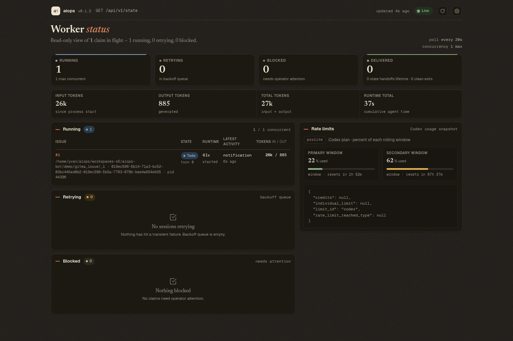
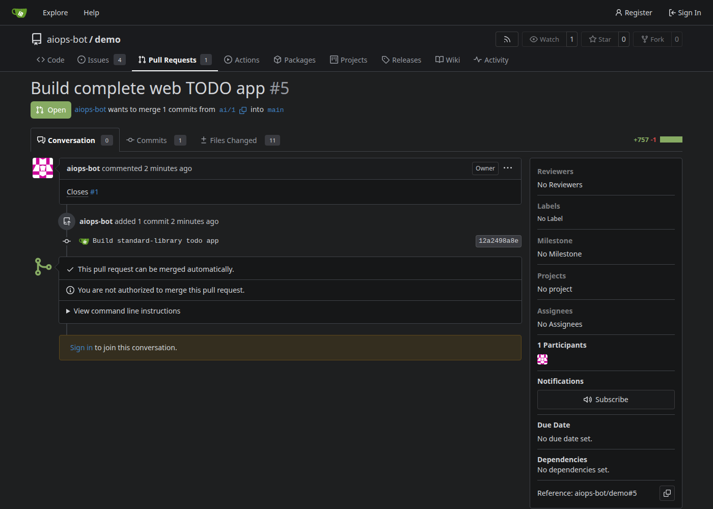
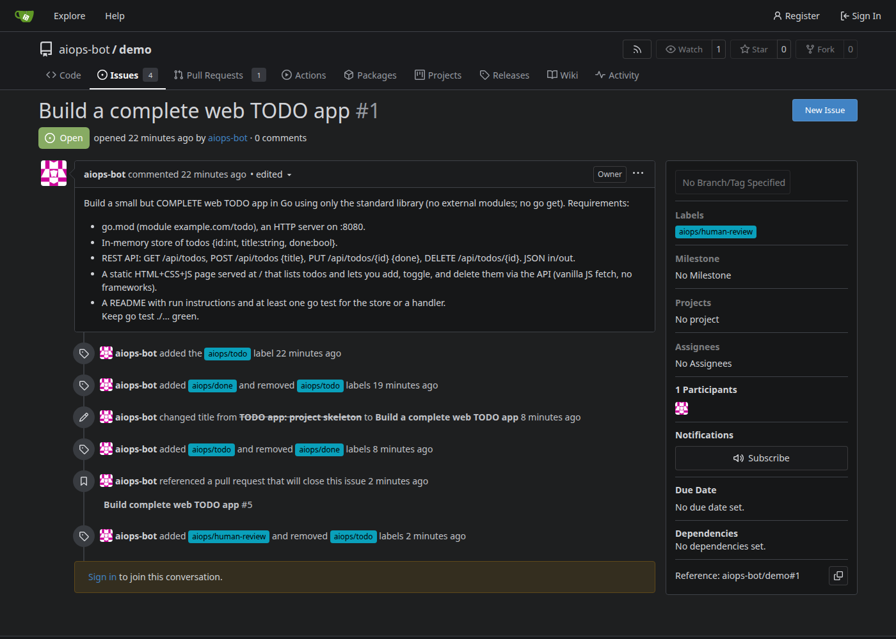
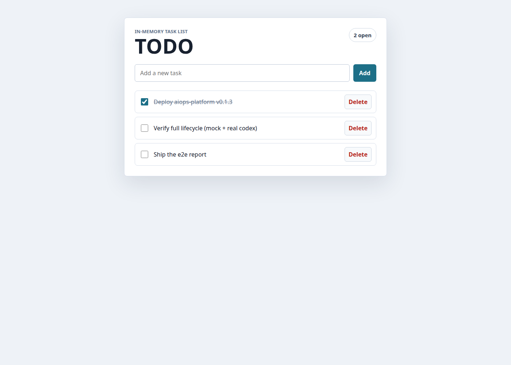
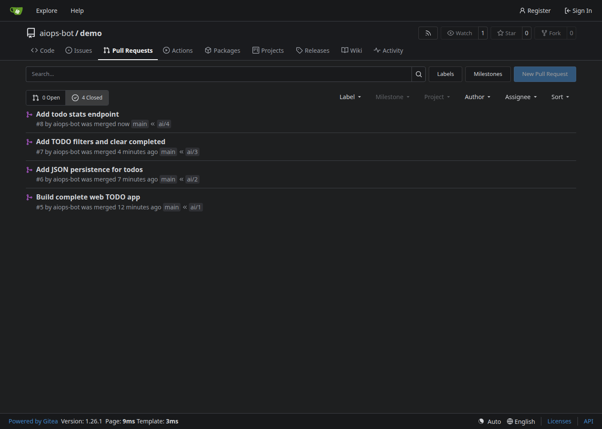
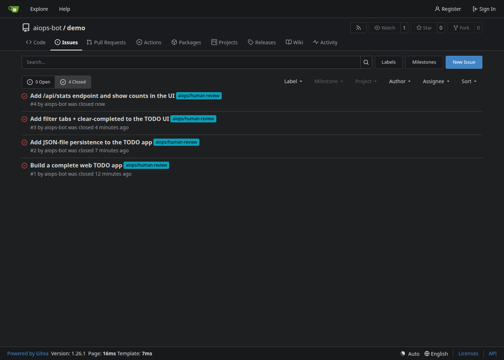
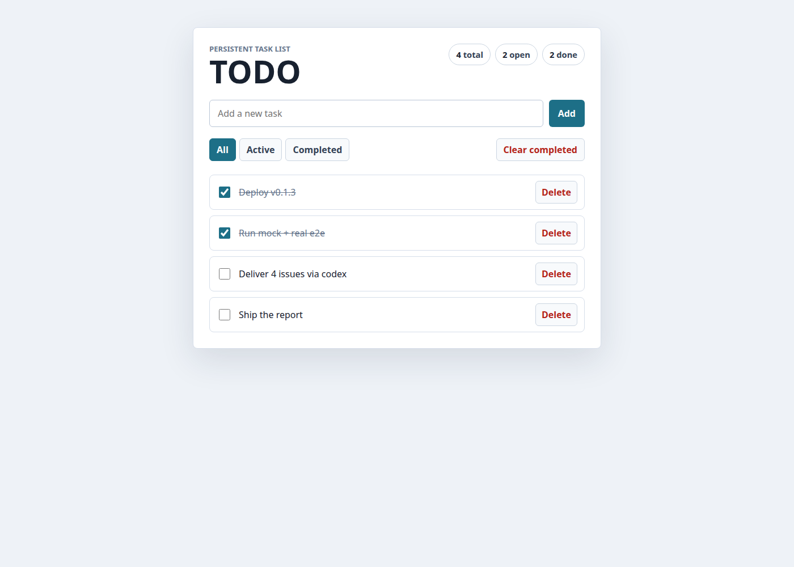

# v0.1.3 local-Gitea binary E2E validation report

Date: 2026-06-14
Repo: `xrf9268-hue/aiops-platform`
Validated artifact: **v0.1.3 release binary** (`aiops-platform_v0.1.3_linux_amd64.tar.gz`)
Repo HEAD at test time: `a0302b7` (`origin/main`; docs-only ahead of the `v0.1.3` tag)
Host: x86_64 Linux · Docker Desktop 29.5.3 · Go 1.25.11 · codex 0.139.0 (gpt-5.5)

> No secrets in this report. The Gitea bot token, the bot password, and the
> basic-auth embedded in `repo.clone_url` were used only from the local shell
> during validation and are intentionally omitted/redacted. The worker's own
> output confirms `tracker.api_key` is masked (`***`) and `MaskCloneURL` strips
> clone-URL userinfo in `--print-config` and logs.

## Scope

Hands-on, real-deployment validation of the released v0.1.3 binary (run natively,
not from source) against a local Gitea (Docker) tracker:

1. Install the v0.1.3 release artifact and verify it.
2. Exercise the full orchestration lifecycle with the `mock` runner.
3. Drive failure / exception paths and confirm correct classification.
4. Run the **real `codex-app-server`** runner to build a web TODO app, opening a
   real PR and performing the agent-owned tracker handoff — then deliver the app
   across **multiple issues**, merging each clean PR to advance the backlog.

Boundary under test (SPEC §1): the worker is a scheduler/runner and tracker
*reader*; the **agent** pushes branches, opens PRs, and writes tracker state.

## Result summary

| Stage | What | Result |
|---|---|---|
| 0 | Automated e2e baseline (`go test -tags e2e -race ./test/e2e/...`) | ✅ PASS |
| 1 | Install v0.1.3 (checksum + provenance + `--version`) | ✅ PASS |
| 2 | Local Gitea + TODO-app backlog | ✅ PASS |
| 3 | Config + `--doctor` preflight + `--print-config` | ✅ PASS |
| 4 | Mock full lifecycle (dispatch/workspace/boundary/capacity/reconcile/cleanup) | ✅ PASS |
| 4B | Failure & exception scenarios (clone/hook/label/dependency/auth/retry) | ✅ PASS |
| 5 | Real codex builds a complete web TODO app + opens PR + handoff | ✅ PASS |
| 5B | Multi-issue delivery: 4 issues → 4 merged PRs, merge-to-advance | ✅ PASS |

The v0.1.3 binary deploys and runs as documented; the orchestration lifecycle is
correct; the SPEC boundary held (worker never pushed/opened/merged on the agent's
behalf); failure paths classified correctly; and a real agent completed the full
write→push→PR→handoff loop across multiple issues with credentials isolated.

One robustness bug was found and filed (issue **#854**); no fix PR was opened
(deferred per request). No other product defects.

## 1. Install (Stage 1)

```text
sha256sum -c            → aiops-platform_v0.1.3_linux_amd64.tar.gz: OK
gh attestation verify   → exit 0 (provenance OK)
worker --version        → v0.1.3      tui --version → v0.1.3
```

The archive ships `worker` + `tui` + `.env.example` + `examples/WORKFLOW.md`.

## 2–3. Topology, config, preflight (Stage 2–3)

- Gitea `1.26.1-rootless` container on `localhost:3000`; bot `aiops-bot`; repo
  `aiops-bot/demo`; six `aiops/*` state labels; a TODO-app backlog of issues.
- Two-credential model verified: the worker holds `GITEA_TOKEN` (polling + the
  `gitea_issue_labels` tool); the agent's push/PR credential is the basic-auth in
  `repo.clone_url` — a separate secret never exported into the agent process.
- `worker --doctor --deploy=binary --mode=mock` → PASS (WARN: `rg` absent;
  dashboard URL not supplied).
- `worker --print-config` → `source: file`, `tracker.api_key: "***"`, and
  `repo.clone_url` rendered as `http://localhost:3000/aiops-bot/demo.git` (userinfo
  stripped) — masking confirmed.

## 4. Mock full lifecycle (Stage 4)

Full SPEC §7.2 phase chain for every active issue:
`PreparingWorkspace → BuildingPrompt → LaunchingAgentProcess → Finishing → Succeeded`
(mirror bare-clone + per-issue `ai/N` worktree; `runner_start`/`runner_end ok:true`).

| Assertion | Result |
|---|---|
| `/readyz`=200 after startup reconcile, `/livez`=ok | ✅ |
| **Boundary**: Gitea branches = `[main]` only, PRs = `[]` (worker does not push/PR) | ✅ |
| Deterministic workspaces `…/demo/gitea_issue/_1..N` | ✅ |
| Per-state/global capacity cap (`max_concurrent_agents`) | ✅ |
| `POST /api/v1/refresh` → 202 `{operations:[poll,reconcile]}` | ✅ |
| Reconcile cleanup on terminal transition → `reconcile_workspace msg="removed workspace" reason:terminal`, workspace `SafeRemove`'d | ✅ |

## 4B. Failure & exception scenarios

Each case: trigger → expected classification/event → assert. All PASS.

| # | Scenario | Trigger | Observed | Result |
|---|---|---|---|---|
| F7 | Bad tracker auth | wrong token, `--doctor --mode=real` | `FAIL Gitea auth: … status 401` + remediation hint | ✅ |
| F1 | Clone failure | `clone_url` → non-existent repo | `fatal: repository … not found` → phase `Failed` | ✅ |
| F8 | Retry on failure | F1 repeats | second attempt after exponential backoff | ✅ |
| F5 | Required-labels gate | `required_labels:[aiops-ready]` | no label → 0 dispatch; after adding it, only that issue is selected | ✅ |
| F6 | Blocked-by dependency | `Depends on #N` in body | blocked while blocker non-terminal; unblocks once blocker → terminal aiops state | ✅ |
| F3 | `before_run` hook failure | `before_run: exit 1` | `hook_end error:exit status 1` → phase `Failed` (agent never launches) | ✅ |
| F4 | `before_remove` hook failure | `before_remove: exit 1` at cleanup | `before_remove_hook_failed` event, but workspace still `SafeRemove`'d | ✅ |

`F2` (mock timeout) is not configurable on the shipped binary (`MockRunner.Sleep`
is a test-only field) and is covered by unit test
`TestMockRunnerTimeoutReturnsTimeoutError`. Protocol-level runner failures
(input-required, mutation-rejected, stall) are covered by the `test/e2e` and unit
suites; operator-terminal-stop / continuation-budget were observed during the
real run below.

## 5. Real codex builds a complete web TODO app (Stage 5)

`--doctor --mode=real`: Codex app-server started and answered a JSON-RPC probe
(auth: ChatGPT login, model `gpt-5.5`); live Gitea auth OK; **WARN** codex 0.139.0
vs pinned 0.137.0; **FAIL** the `bwrap` workspace-write sandbox because this host
restricts unprivileged user namespaces (Ubuntu `kernel.apparmor_restrict_unprivileged_userns=1`).
The doctor surfaced this clearly with remediation. For this controlled local test
`codex.thread_sandbox: danger-full-access` was used (trusted codex, benign build,
throwaway workspace); **production should use a container/AppArmor sandbox**.

Real lifecycle on issue #1 ("Build a complete web TODO app", ~4m42s):
`PreparingWorkspace → … → InitializingSession → session_started → StreamingTurn → turn_started`,
then the agent completed the full handoff (every step performed by the **agent**):

| Step | Evidence | Result |
|---|---|---|
| Write code | 11 files / 757 LOC (Go net/http + static UI + tests); `go test ./...` ok | ✅ |
| Flip label | `tool_call_mutation tool:gitea_issue_labels current_issue_non_active_state_update:true` | ✅ |
| **Credential isolation** | agent had no `GITEA_TOKEN`; label via orchestrator tool, PR via clone_url basic-auth | ✅ |
| Push branch | Gitea branches = `[ai/1, main]` | ✅ |
| Open PR | PR #5 "Build complete web TODO app" (ai/1→main, "Closes #1", +757/-1, mergeable, by `aiops-bot`) | ✅ |
| Flip to Human Review | issue #1 → `aiops/human-review` | ✅ |
| Worker handoff classification | `runner_stopped reason:reconcile_ineligible` (ok:true) and `/api/v1/state` `agent_handoff_reconcile_stopped:["1"]` (SPEC #557, distinct from operator-stop/failure) | ✅ |

Worker dashboard during the real run (version chip, `Running: 1`, rate-limit/token panel):



The agent-opened PR #5 ("Closes #1", +757/−1, 11 files, can be merged automatically):



Issue #1 after the agent flipped it to Human Review and referenced the closing PR:



The TODO app the agent built, running and serving its API + UI:



TUI (`tui --raw`) mirrored the same state:
`Agents: 0/1 · Handoffs: completed 0 | agent 1 (recent 1) · Tokens in 436,085 / out 12,563`.

## 5B. Multi-issue delivery — merge each clean PR to advance

The TODO app was delivered across **four issues**, built incrementally by the real
codex agent. The worker (`max_concurrent_agents: 1`) processed them serially; for
each, the agent wrote code, pushed `ai/N`, and opened a PR; the operator verified
(`go test` + build green on the branch) and **merged** the PR, advancing `main` so
the next issue branched from the updated tree.

| Issue | Feature | PR | Size | Verify | Result |
|---|---|---|---|---|---|
| #1 | Complete TODO app (CRUD + static UI, in-memory) | #5 | +757/-1, 11 files | `go test` ok | ✅ merged |
| #2 | JSON-file persistence | #6 | +235/-12, 6 files | `ai/2` ok | ✅ merged |
| #3 | UI filter tabs + "Clear completed" | #7 | +134/-2, 3 files | `ai/3` ok | ✅ merged |
| #4 | `/api/stats` endpoint + UI counts | #8 | +131/-6, 6 files | `ai/4` ok | ✅ merged |

All four PRs were opened by `aiops-bot` itself (push `ai/N` + Gitea pulls API via
clone_url basic-auth), each carrying `Closes #N`; all four issues were flipped to
Human Review via the token-isolated `gitea_issue_labels` tool and then closed.
Every worker stop was classified `agent_handoff_reconcile_stopped` (not failure).

All four PRs merged:



All four issues closed:



The final app on `main` (all four features) — `go test` green,
`GET /api/stats` → `{"total":4,"open":2,"done":2}`, `todos.json` persisted, UI with
filter tabs + "Clear completed" + header counts:



> These are **demo-repo** PRs (throwaway test artifacts) merged to advance the
> multi-issue build; this is separate from how aiops-platform's own repo handles
> findings (issue-only here — see below).

## 6. Findings

- **#854** (`type:bug`, `area:workspace`, `priority:p3`): changing `workspace.root`
  while the shared bare mirror cache persists leaves a stale per-branch worktree
  registration, so the next dispatch fails with
  `fatal: 'ai/N' is already used by worktree at <old path>` and keeps failing.
  Workaround: clear `~/.cache/aiops-platform/mirrors`. Filed; no fix PR this round.

No other product defects. The bwrap-sandbox block and the codex version-drift
warning are environmental and are well surfaced by `--doctor`; the SPEC boundary
held throughout; failure and handoff classifications were all correct.

## Reproduce

Install path and config are per `docs/runbooks/binary-deployment.md` (Option B) and
`examples/gitea-WORKFLOW.md` (tracker `endpoint: http://localhost:3000`,
`agent.default: mock` first, then `codex-app-server`). The dashboard/TUI/app were
served on loopback (`:4000` / `:8080`) and the Gitea tracker in Docker (`:3000`).
