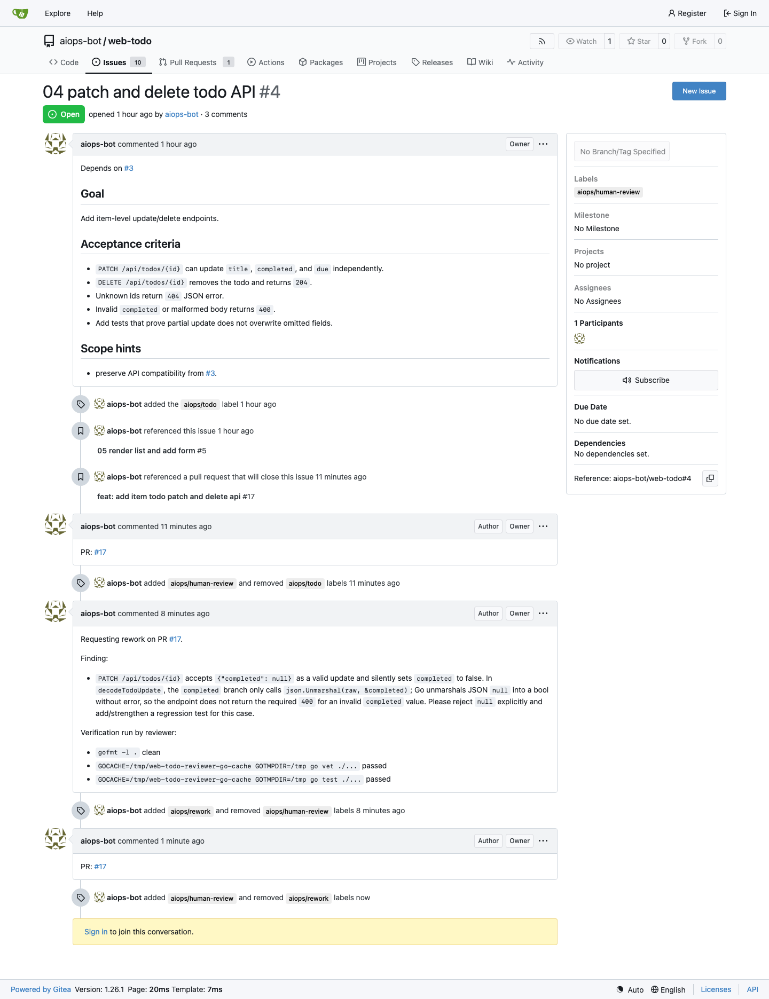
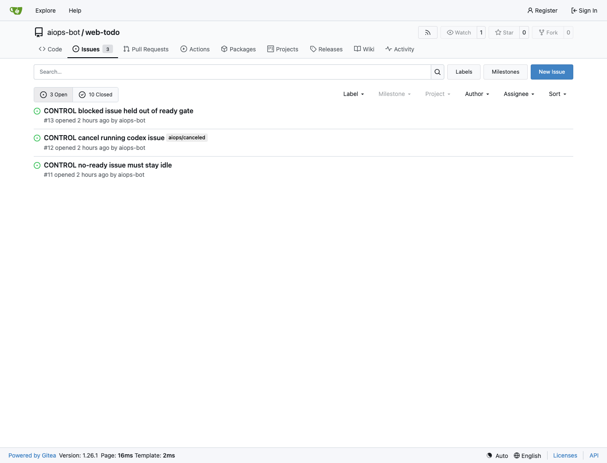
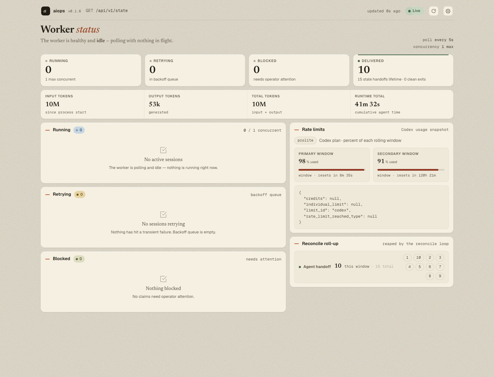
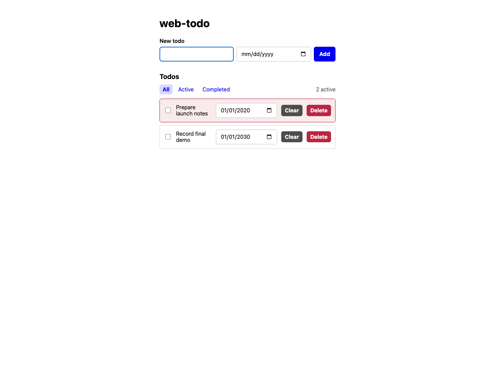
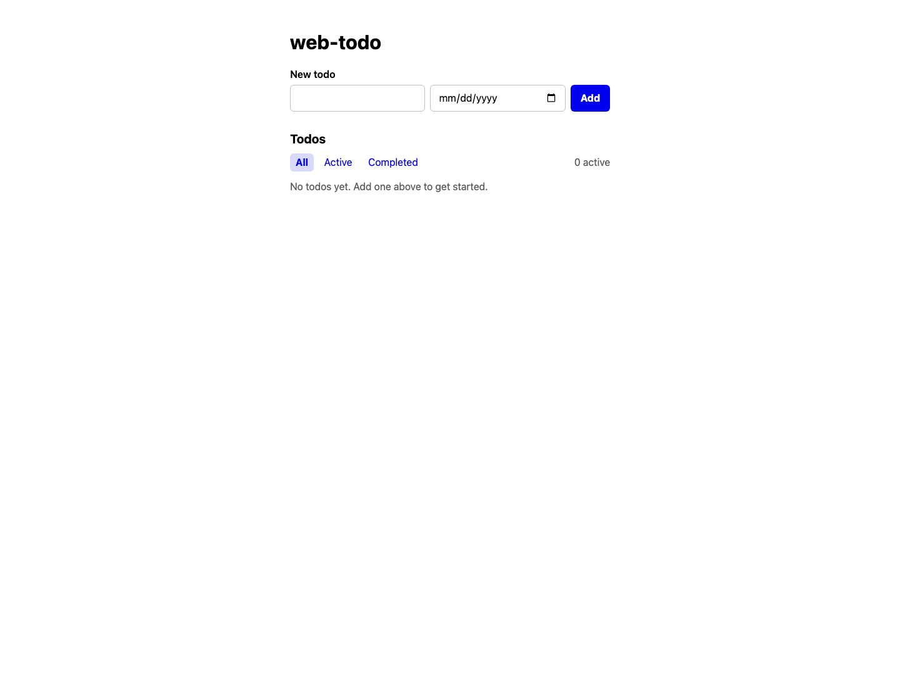

# Web Todo E2E Lifecycle Test Report

Run root: `/tmp/aiops-webtodo-e2e-20260617-134243`
Date: 2026-06-17
Target: latest downloaded aiops-platform binary `v0.1.6` + local Codex app-server + local Gitea web-todo repo.

## Verdict

PASS with operational findings.

No secrets are committed in this evidence pack. Loopback Gitea, dashboard, and TUI addresses are disposable local-test references; credential-bearing config and Codex auth files are intentionally excluded.

The maker-WORKFLOW + reviewer-automerge-WORKFLOW lifecycle completed all 10 planned primary issues. Each primary issue produced a PR, reviewer processing, automerge, and final `aiops/done`. Control issues stayed idle unless explicitly activated, and canceling an active Codex run stopped it through the worker lifecycle.

## Environment

- Gitea: `http://127.0.0.1:3107/aiops-bot/web-todo`
- Maker dashboard: `http://127.0.0.1:4101/`
- Reviewer dashboard: `http://127.0.0.1:4102/`
- Worker binary: `/tmp/aiops-webtodo-e2e-20260617-134243/bin/worker`
- TUI binary: `/tmp/aiops-webtodo-e2e-20260617-134243/bin/tui`
- Final repo clone: `/tmp/aiops-webtodo-e2e-20260617-134243/final-verify/web-todo`

## Final Worker State

Maker counts: `{'running': 0, 'blocked': 0, 'retrying': 0, 'completed': 0, 'completed_total': 0, 'reconcile_stopped_with_progress': 0, 'reconcile_stopped_with_progress_total': 0, 'agent_handoff_reconcile_stopped': 10, 'agent_handoff_reconcile_stopped_total': 14, 'operator_terminal_stops': 1, 'operator_terminal_stops_total': 1}`

Reviewer counts: `{'running': 0, 'blocked': 0, 'retrying': 0, 'completed': 0, 'completed_total': 0, 'reconcile_stopped_with_progress': 0, 'reconcile_stopped_with_progress_total': 0, 'agent_handoff_reconcile_stopped': 10, 'agent_handoff_reconcile_stopped_total': 15, 'operator_terminal_stops': 0, 'operator_terminal_stops_total': 0}`

## Primary Issue Results

| Issue | Title | State | Labels |
|---|---|---|---|
| #1 | 01 scaffold stdlib server | closed | aiops/done |
| #2 | 02 add JSON todo store | closed | aiops/done |
| #3 | 03 list and create todos API | closed | aiops/done |
| #4 | 04 patch and delete todo API | closed | aiops/done |
| #5 | 05 render list and add form | closed | aiops/done |
| #6 | 06 [EXPECT-REWORK] toggle and delete interactions | closed | aiops/done |
| #7 | 07 client-side filters and active counter | closed | aiops/done |
| #8 | 08 due dates and overdue highlighting | closed | aiops/done |
| #9 | 09 inline title editing | closed | aiops/done |
| #10 | 10 docs, Makefile, and final smoke | closed | aiops/done |
| #11 | CONTROL no-ready issue must stay idle | open | - |
| #12 | CONTROL cancel running codex issue | open | aiops/canceled |
| #13 | CONTROL blocked issue held out of ready gate | open | - |

## PR Results

| PR | Title | Branch | State | Merged |
|---|---|---|---|---|
| #14 | feat: scaffold stdlib server | ai/1 | closed | yes |
| #15 | feat: add JSON todo store | ai/2 | closed | yes |
| #16 | feat: add todos list and create API | ai/3 | closed | yes |
| #17 | feat: add item todo patch and delete api | ai/4 | closed | yes |
| #18 | feat: add todo list UI | ai/5 | closed | yes |
| #19 | feat: add todo toggle and delete controls | ai/6 | closed | yes |
| #20 | feat: add client-side todo filters | ai/7 | closed | yes |
| #21 | feat: support todo due dates | ai/8 | closed | yes |
| #22 | feat: add inline title editing | ai/9 | closed | yes |
| #23 | docs: document newcomer workflow | ai/10 | closed | yes |

## Control Scenarios

- #11 no-ready issue: stayed open with no labels and no PR.
- #13 blocked/held issue: stayed open with no labels and no PR.
- #12 cancel-running issue: was labeled `aiops/todo`, maker started it, then label was replaced with `aiops/canceled`; maker stopped the active run within the polling window and no PR was created.

## Abnormal / High-Value Findings

1. Initial reviewer app-server session could start with zero useful progress until the workflow command was tightened to low reasoning effort. This exposed sensitivity to local Codex config/tool surface.
2. Codex app-server still inherited user-level skills/plugins/MCP startup behavior even when command-line overrides attempted to minimize `mcp_servers` and `plugins`.
3. Reviewer caught a real API edge case on #4: `completed: null` was accepted as false. The flow went `human-review -> rework -> maker fix -> human-review -> merge -> done`.
4. #6 validated the intentional rework loop: reviewer requested regression coverage for deleting the final todo returning to empty state.
5. #7 required repeated rework because maker initially supplied weak source-string checks. Reviewer enforced behavior-level test quality before merge.
6. Several issues showed a short tail window where PR/branch already existed but the issue label had not yet switched to `human-review`; workers eventually reconciled.
7. A brief handoff overlap occurred on #7 where maker and reviewer both showed the same issue in flight; the maker runner stopped on the next reconcile sample.
8. Token usage was high in this local desktop Codex environment; this is an operational concern for unattended batch runs.
9. A mid-run #5 UI probe produced a blank browser screenshot from the PR branch harness, but final fresh-main Playwright smoke passed. Treat the #5 probe as investigative evidence, not final product failure.

## Verification

Commands run on fresh clone:

```text
$ gofmt -l .
$ go vet ./...
$ go test ./...
ok  	web-todo/cmd/server	1.225s
ok  	web-todo/internal/store	1.513s
$ make test
go test ./...
ok  	web-todo/cmd/server	(cached)
ok  	web-todo/internal/store	(cached)
$ make build
go build ./cmd/server
```

Final browser smoke passed:

- Created two todos, one overdue.
- Verified overdue styling.
- Toggled completion and verified active/completed filters.
- Inline-edited a title.
- Deleted all todos and verified empty state.
- Browser console log: `assets/2026-06-17-webtodo-browser-console.log`

Console output was empty: `True`.

## Promotion Artifacts

Primary notes: `2026-06-17-webtodo-promotion-materials.md`

Capture index: `2026-06-17-webtodo-capture-index.md`

Screenshots:
- Gitea issue #4 rework: `assets/2026-06-17-webtodo-gitea-issue-04-rework.png`
- Gitea issue #4 done: `assets/2026-06-17-webtodo-gitea-issue-04-done.png`
- Gitea issue #7 rework: `assets/2026-06-17-webtodo-gitea-issue-07-rework.png`
- Gitea all issues final: `assets/2026-06-17-webtodo-gitea-issues-all-done.png`
- Maker dashboard final: `assets/2026-06-17-webtodo-maker-dashboard-final.png`
- Reviewer dashboard final: `assets/2026-06-17-webtodo-reviewer-dashboard-final.png`
- Final UI created/overdue: `assets/2026-06-17-webtodo-webui-final-created-overdue.png`
- Final UI edited: `assets/2026-06-17-webtodo-webui-final-edited.png`
- Final UI empty after delete: `assets/2026-06-17-webtodo-webui-final-empty-after-delete.png`

Video:
- Browser smoke video: `assets/2026-06-17-webtodo-browser-smoke.webm`

## Final Notes

The lifecycle test produced strong demo material: Gitea issue/PR timelines, worker dashboards, TUI raw snapshots, reviewer rework comments, final browser UI screenshots, and a smoke-test video. The system completed the requested 10-issue lifecycle, while also surfacing realistic operator concerns around Codex app-server context weight and repeated reviewer-driven rework.


## Repository Evidence Pack

Committed alongside this report:

- Full Gitea, maker dashboard, reviewer dashboard, and final Web UI screenshot set under `docs/validation/assets/` with the `2026-06-17-webtodo-` prefix.
- Final browser smoke recording: [assets/2026-06-17-webtodo-browser-smoke.webm](assets/2026-06-17-webtodo-browser-smoke.webm).
- TUI raw captures: [maker](assets/2026-06-17-webtodo-tui-maker-raw.txt) and [reviewer](assets/2026-06-17-webtodo-tui-reviewer-raw.txt).
- Final verification log: [assets/2026-06-17-webtodo-verification.log](assets/2026-06-17-webtodo-verification.log).
- Browser console log: [assets/2026-06-17-webtodo-browser-console.log](assets/2026-06-17-webtodo-browser-console.log) (empty in the passing smoke run).
- Promotion notes: [2026-06-17-webtodo-promotion-materials.md](2026-06-17-webtodo-promotion-materials.md).
- Capture index: [2026-06-17-webtodo-capture-index.md](2026-06-17-webtodo-capture-index.md).

## Visual Highlights

Reviewer caught the #4 API edge case and sent the issue back to rework:



The full 10-issue lifecycle ended with every primary issue done:



Both worker dashboards were idle after maker/reviewer completion:




The final Web UI smoke covered overdue, filters, inline edit, and empty-after-delete paths:




